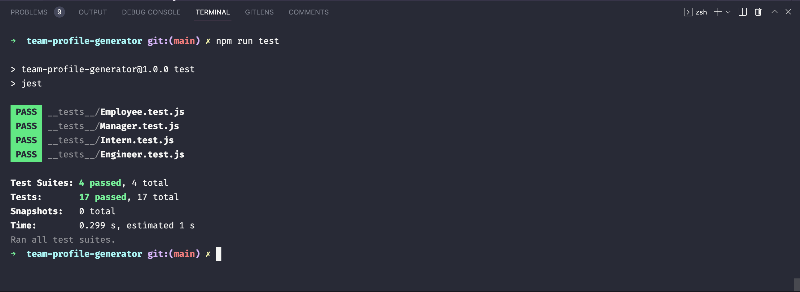

# 10 Object-Oriented Programming: Team Profile Generator


## Description

A Node.js command-line application that takes in information about employees on a software engineering team and generates an HTML webpage that displays summaries for each person. It includes passing tests for each part of the code to ensure usability and accessability.


## Table of Contents
- [User Story](#user-story)
- [Installation](#installation)
- [Usage](#usage)
- [Demonstration](#demonstration)
- [License](#license)
- [Contributing](#contributing)
- [Questions](#questions)


## User Story

```md
AS A manager
I WANT to generate a webpage that displays my team's basic info
SO THAT I have quick access to their emails and GitHub profiles
```

## Installation

Please fork this repository over to your local sytem. 

Once you have forked this repository, please initialize the npm modules into the repo through the command `npm install`. The package.json file holds the necessary dependencies for testing through Jest and command-line prompts in Node.

The directory is set up in the following structure:

```md
.
├── __tests__/             //jest tests
│   ├── Employee.test.js
│   ├── Engineer.test.js
│   ├── Intern.test.js
│   └── Manager.test.js
├── dist/                  // rendered output (HTML) and CSS style sheet
├── lib/                   // classes
│   ├── Employee.js
│   ├── Engineer.js
│   ├── Intern.js
│   ├── Manager.js
│   └── Prompts.js
├── src/                   // HTML template code
│    └── profile-template.js
├── .gitignore             // indicates which folders and files Git should ignore
├── index.js               // runs the application
└── package.json
```

## Usage

- The index.js file contains the methods to initialize the command-line prompt
- Initialize your command-line within the root directory of this repository
- Initialize the generator by entering `node index.js` into your command-line 
- Answer the following question prompts
- You can find your completed team profile in the 'dist' folder named 'index.html'

### Demonstration

- [Walkthrough Video Link](https://drive.google.com/file/d/1bCN02Eg0PAcZiPjldtrgkeCP3FY9q5Vr/view)




## License
This application is licensed under the MIT license. Please click on the link below to learn more.

https://opensource.org/licenses/MIT

## Contributing

Pull requests are welcome. For major changes, please open an issue first to discuss what you would like to change.

## Questions

Please direct any questions about this project to olivelliott48@gmail.com. If you would like to see more projects, visit the GitHub link below.

https://www.github.com/olivelliott
